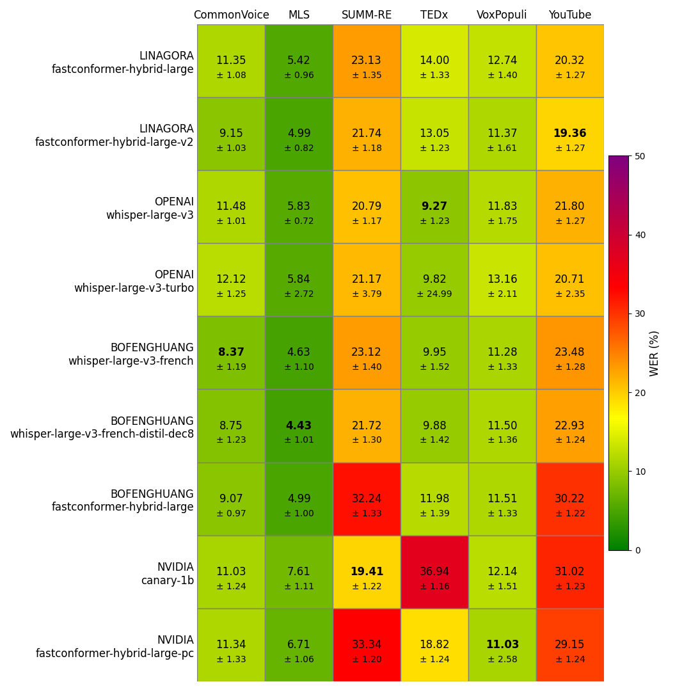

# French ASR Benchmark

I will try to update this benchmark by adding new models or data.

## Data

The benchmark is done on 6 french datasets:
- Common Voice
- Multilingual LibriSpeech
- VoxPopuli
- SUMM-RE
- TEDx
- YouTube

For most of them I randomly selected utterances from the test set to have a at least 1 hour of data. Whisper is pretty slow, that's why I selected a subset. I also removed all utterances under 2 seconds.

## WER

The following table gives the result of the WER on several french datasets:

The code to re create the results and the figure are availble in this folder.