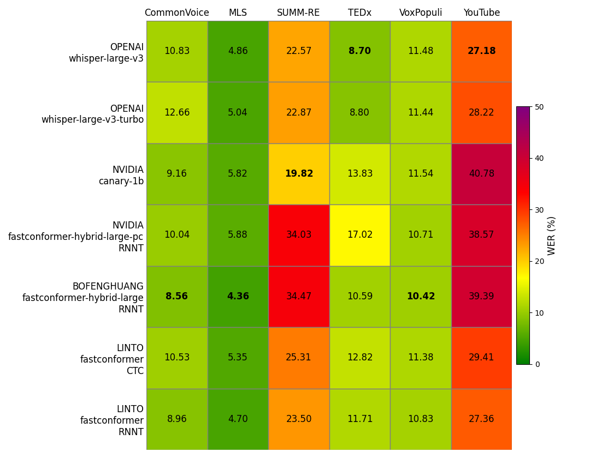

# LinTO STT FR Fastconformer
## Data

The benchmark is done on 6 french datasets:
- Common Voice
- Multilingual LibriSpeech
- VoxPopuli
- SUMM-RE
- TEDx
- YouTube

## WER

The following table gives the result of the WER on several french datasets:

The code to re create the results and the figure are availble in this folder.